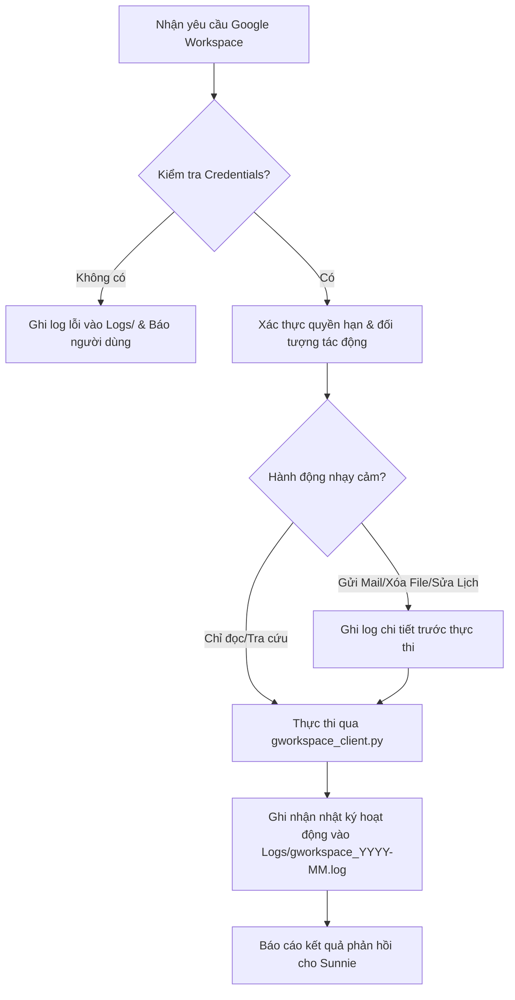

# 📖 SOP: Quy Trình Quản Lý & Tự Động Hóa Google Workspace

**Mã SOP:** `SOP-GWS-001`  
**Ngày ban hành:** `2026-07-31`  
**Đối tượng áp dụng:** Tất cả AI Agent hoạt động trong hệ thống.

---

## 🎯 Mục Đích
Chuẩn hóa quy trình thao tác với các dịch vụ Google Workspace (Gmail, Google Calendar, Google Drive, Google Sheets, Google Docs), đảm bảo an toàn thông tin, tránh gửi nhầm mail, mất dữ liệu hoặc vi phạm bảo mật.

---

## 🔄 Chu Trình Thực Hiện Từng Bước (Step-by-Step SOP)

---

## 📋 Các Quy Tắc Kiểm Soát An Toàn (Security Checkpoints)

1. **Trước khi gửi Email (`Gmail`)**:
   - Kiểm tra kỹ địa chỉ `To`, `Cc`, `Bcc`.
   - Đảm bảo tiêu đề và nội dung không chứa secret hay API key riêng tư.
2. **Trước khi tạo hoặc chỉnh sửa Lịch (`Google Calendar`)**:
   - Xác nhận múi giờ đúng chuẩn `Asia/Ho_Chi_Minh` (`+07:00`).
   - Đảm bảo không đè lên lịch họp quan trọng có sẵn.
3. **Thao tác với Tệp Tin & Thư Mục (`Google Drive`)**:
   - Không thực hiện lệnh xóa vĩnh viễn (`delete`) trừ khi có yêu cầu trực tiếp từ Sunnie.
   - Khi chia sẻ file, ưu tiên quyền `Reader` trước `Editor`.
4. **Ghi và Đọc Bảng Tính (`Google Sheets`)**:
   - Sử dụng phương thức `append` để ghi tiếp nối dữ liệu thay vì `update` đè lên hàng trăm dòng cũ.
   - Định dạng dữ liệu thời gian chuẩn ISO 8601.

---

## 🛠️ Xử Lý Sự Cố (Troubleshooting)

- **Lỗi 401 Unauthorized**: Tệp token hoặc service account hết hạn. Cần cập nhật lại key trong `Credentials/`.
- **Lỗi 403 Forbidden**: Chưa cấp quyền chia sẻ (Share) tệp/thư mục cho Email của Service Account.
- **Lỗi 404 Not Found**: Sai `Spreadsheet ID`, `Document ID` hoặc `File ID`.
